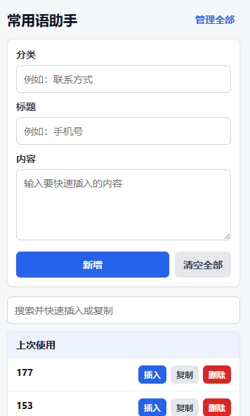
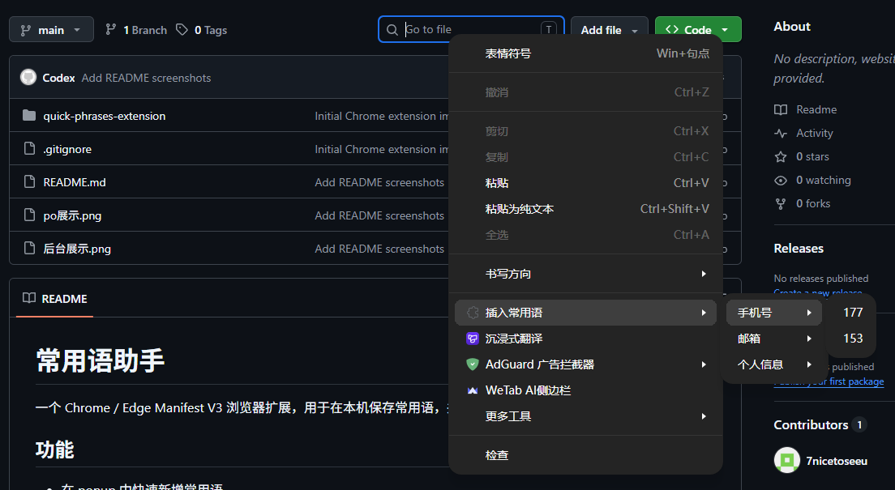
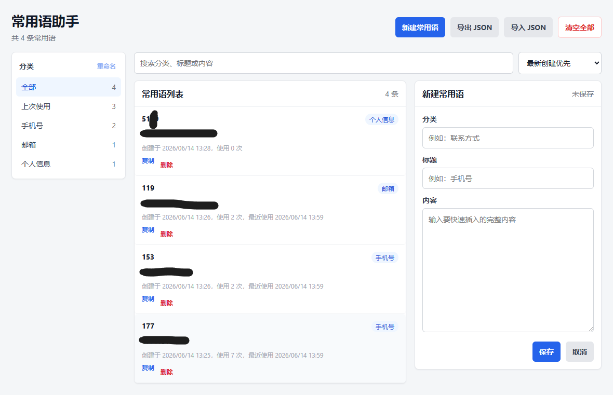

# 常用语助手：一个本地保存、右键插入的浏览器常用语插件

我做了一个 Chrome / Edge 浏览器插件，名字叫 **常用语助手**。

它主要解决一个很小但高频的问题：平时在网页里经常要重复输入一些固定内容，比如联系方式、客服回复、地址、说明模板、链接、账号信息等。以前可能要从备忘录、聊天记录、文档里来回复制，现在可以直接通过浏览器插件保存，然后在网页输入框里右键快速插入。

## 它能做什么

- 保存常用语，包含分类、标题、内容。
- 在浏览器 popup 里快速新增、搜索、复制、插入。
- 在网页输入框、textarea、可编辑区域中右键插入常用语。
- 通过后台管理页统一管理全部常用语。
- 支持分类展示、搜索、排序、编辑、删除、清空。
- 支持导入 / 导出 JSON，方便备份和迁移。
- 支持分类重命名。
- 支持记录使用次数和最近使用时间。
- 支持“上次使用”分类，自动展示最近用过的最多 5 条。

## 使用场景

这个插件比较适合这些场景：

- 客服、运营、销售需要频繁回复固定话术。
- 经常填写相同联系方式、地址、链接。
- 需要在多个网站里复用同一批文本模板。
- 不想把常用语上传到第三方服务，只想保存在本机浏览器。

## 数据保存在哪里

所有数据都保存在浏览器本机：

```js
chrome.storage.local
```

不会上传到服务器，也没有后端服务。

如果要换电脑或重装浏览器，可以先在管理页导出 JSON，再导入到新环境。

## 项目特点

- Manifest V3。
- 原生 HTML / CSS / JavaScript。
- 不依赖 React、Vue、npm 或构建工具。
- 直接通过“加载已解压的扩展程序”运行。
- Chrome 和 Edge 都可以使用。

## 页面预览

### Popup 快速操作



### 右键菜单插入



### 后台管理页面



## 安装方式

1. 下载项目代码。
2. 打开 Chrome 的 `chrome://extensions/`，或 Edge 的 `edge://extensions/`。
3. 开启“开发者模式”。
4. 点击“加载已解压的扩展程序”。
5. 选择项目里的 `quick-phrases-extension` 文件夹。

## 项目地址

```text
https://github.com/7nicetoseeu/quick-phrases-extension
```

有类似需求的朋友可以试试看，也欢迎提建议。
